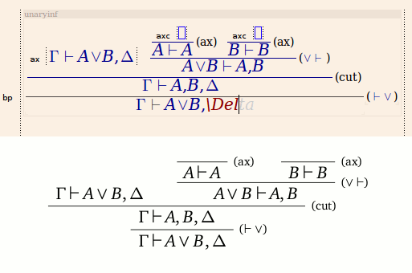

## Synopsis

[LyX](https://www.lyx.org) is a time saver for producing LaTeX documents, but has no built-in support for the semantic edition of proof derivation as used in logic. **LyXproofs** is a set of LyX macros for proof derivations that relies on the LaTeX package [bussproofs](https://math.ucsd.edu/~sbuss/ResearchWeb/bussproofs/). 

## Use

See `lyxproofs-guide.lyx`.

## License

GNU Affero GPL v3.0. See `LICENSE`.

